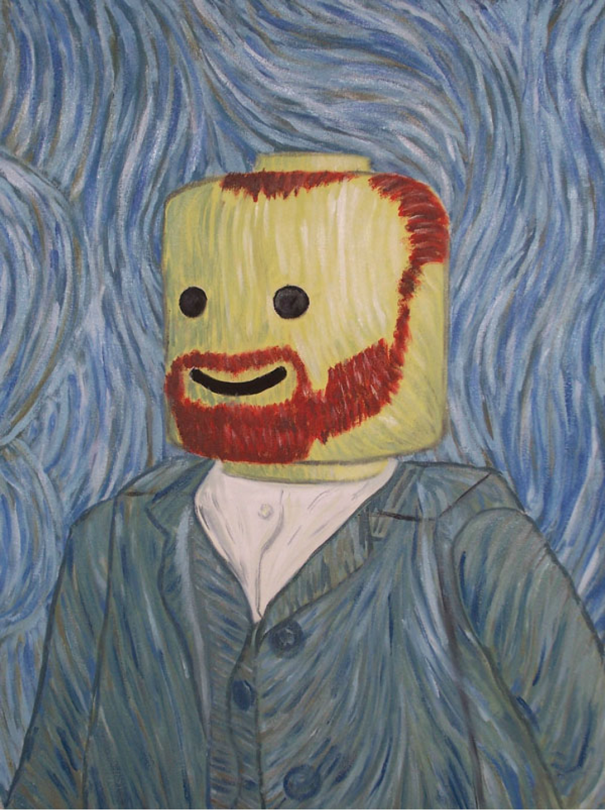

{::options parse_block_html="true" /}

	

	
	

	

	##Etienne Ackermann

	<strong>Graduate Student, [Electrical and Computer Engineering](http://www.ece.rice.edu/), 
	[Rice University](http://www.rice.edu)
	</strong>

	* * *

	<h3> Contact info </h3>

	**email: etienne.ackermann <i>at</i> rice.edu**

	<strong>
	6500 Main St  
	Biosciences Research Collaborative 702  
	Houston, TX 77030
	</strong>
	

* * * 

<h2> Projects</h2>

###Probabilistic modeling of neural reactivation

This is a project description

Blah blah blah

###Three dimensional spatial representation in the hippocampus

This is a project description

Blah blah blah

### Uninterupted chronic wireless neural recording

This is a project description

Blah blah blah

### High density microdrive tetrode array

This is a project description

Blah blah blah

### Real-time video tracking and offline video analysis and annotation

This is a project description

Blah blah blah

<h3> Education</h3>

2005-2008 | | B.Eng (Computer Engineering), University of Pretoria, South Africa
2008-2009 | | B.Hons (Electronic Engineering), University of Pretoria, South Africa
2009-2011 | | M.Eng (Electronic Engineering), University of Pretoria, South Africa
2011-2013 | | MA (Computational and Applied Mathematics), Rice University, Houston TX
2013- | | PhD (Electrical and Computer Engineering), Rice University, Houston TX

<!--
<h3> Teaching </h3>

**Fall 2014**  |    | [ELEC548](http://dsp.rice.edu/courses/elec548)
**Spring 2014** |   | [ELEC327](http://dsp.rice.edu/courses/elec327-0)
**Fall 2013** |   | [ELEC548](http://dsp.rice.edu/courses/elec548-2013)
**Spring 2013** |   | [ELEC327](http://dsp.rice.edu/courses/elec327)
**Fall 2012** |   | ELEC548
**Spring 2012** |   | ELEC631

<h3> Publications </h3>

[Google Scholar Profile](http://scholar.google.com/citations?user=tA0QQq0AAAAJ)

*full listing coming soon*

-->

